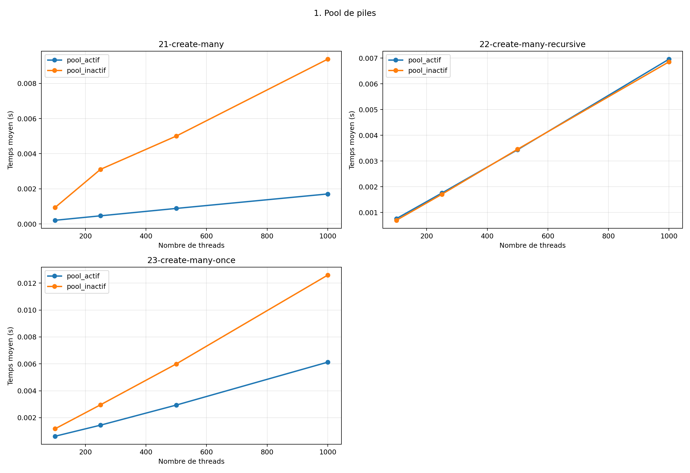

# 1. Pool de piles

Comparaison entre la réutilisation des piles et l'allocation d'une pile neuve à chaque thread. Les
gains apparaissent surtout sur les tests de création massive.

## Variantes comparées

- pool_actif: THREAD_DISABLE_STACK_POOL=0
- pool_inactif: THREAD_DISABLE_STACK_POOL=1

## Graphique

## Fichiers

- [mesures.csv](mesures.csv)
- [graphique.png](graphique.png)

## Lecture rapide

### 21-create-many

- pool_actif: premier point = 0.000213s, dernier point = 0.001710s
- pool_inactif: premier point = 0.000942s, dernier point = 0.009376s

### 22-create-many-recursive

- pool_actif: premier point = 0.000763s, dernier point = 0.006956s
- pool_inactif: premier point = 0.000699s, dernier point = 0.006853s

### 23-create-many-once

- pool_actif: premier point = 0.000623s, dernier point = 0.006125s
- pool_inactif: premier point = 0.001177s, dernier point = 0.012593s

