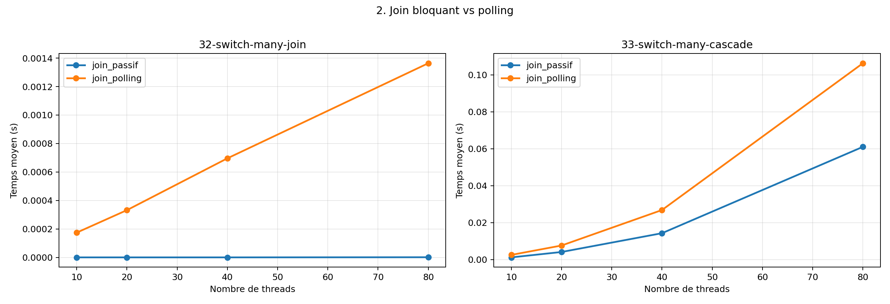

# 2. Join bloquant vs polling

Comparaison entre le join passif actuel et une variante de type polling qui relance régulièrement
thread_yield().

## Variantes comparées

- join_passif: THREAD_JOIN_POLLING=0
- join_polling: THREAD_JOIN_POLLING=1

## Graphique

## Fichiers

- [mesures.csv](mesures.csv)
- [graphique.png](graphique.png)

## Lecture rapide

### 32-switch-many-join

- join_passif: premier point = 0.000000s, dernier point = 0.000001s
- join_polling: premier point = 0.000174s, dernier point = 0.001364s

### 33-switch-many-cascade

- join_passif: premier point = 0.001181s, dernier point = 0.061017s
- join_polling: premier point = 0.002527s, dernier point = 0.106272s

