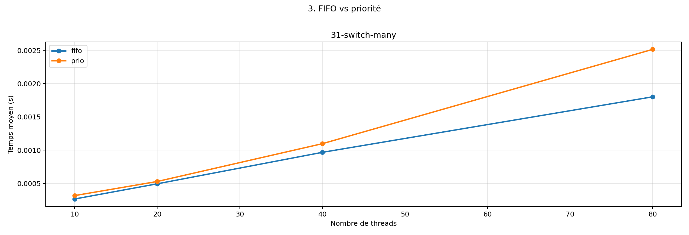

# 3. FIFO vs priorité

Comparaison entre l'ordonnancement FIFO et l'ordonnancement par priorité sur un test riche en
yields.

## Variantes comparées

- fifo: THREAD_SCHED_POLICY=THREAD_SCHED_FIFO
- prio: THREAD_SCHED_POLICY=THREAD_SCHED_PRIO

## Graphique

## Fichiers

- [mesures.csv](mesures.csv)
- [graphique.png](graphique.png)

## Lecture rapide

### 31-switch-many

- fifo: premier point = 0.000267s, dernier point = 0.001802s
- prio: premier point = 0.000318s, dernier point = 0.002515s

