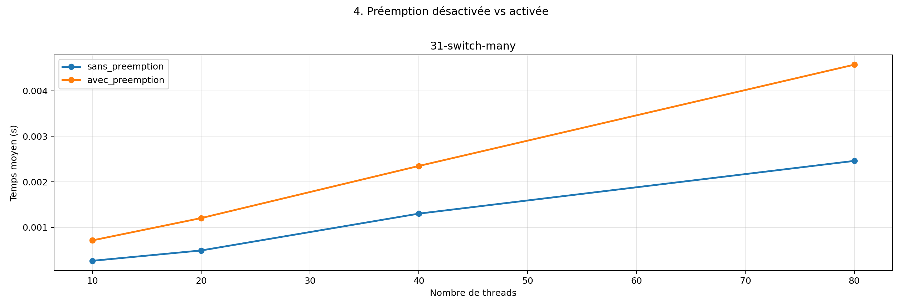

# 4. Préemption désactivée vs activée

Mesure du surcoût de la préemption par signal sur un workload coopératif avec beaucoup de
changements de contexte.

## Variantes comparées

- sans_preemption: THREAD_ENABLE_PREEMPTION=0
- avec_preemption: THREAD_ENABLE_PREEMPTION=1

## Graphique

## Fichiers

- [mesures.csv](mesures.csv)
- [graphique.png](graphique.png)

## Lecture rapide

### 31-switch-many

- sans_preemption: premier point = 0.000266s, dernier point = 0.002460s
- avec_preemption: premier point = 0.000714s, dernier point = 0.004573s

